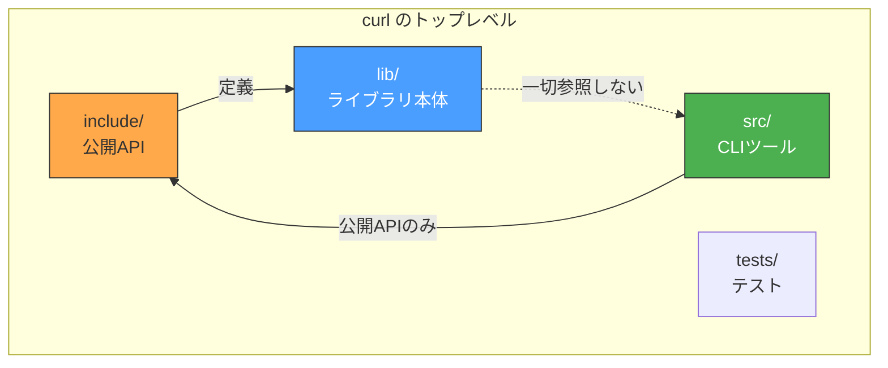
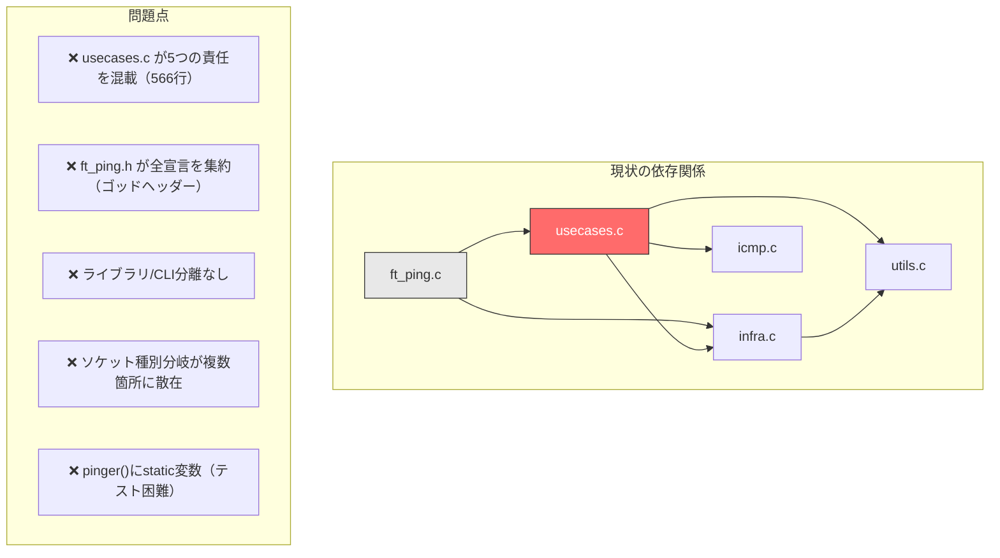
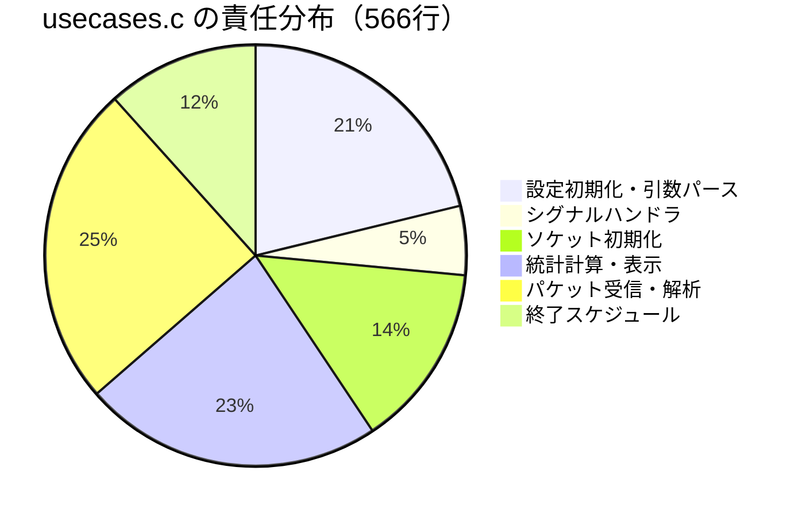
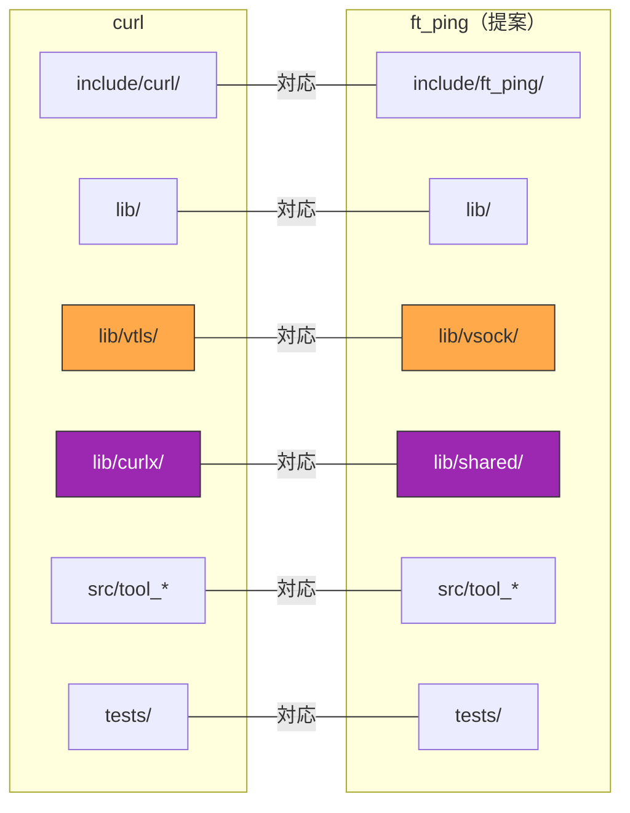
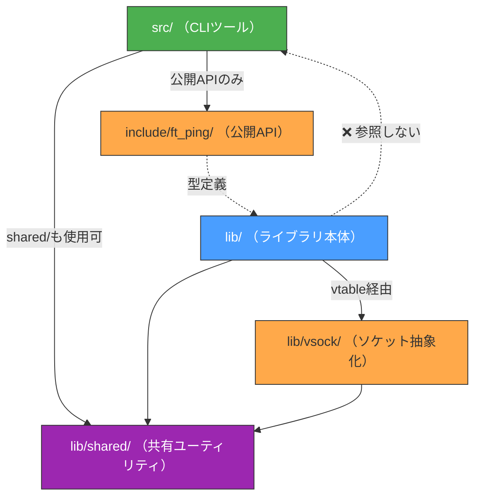
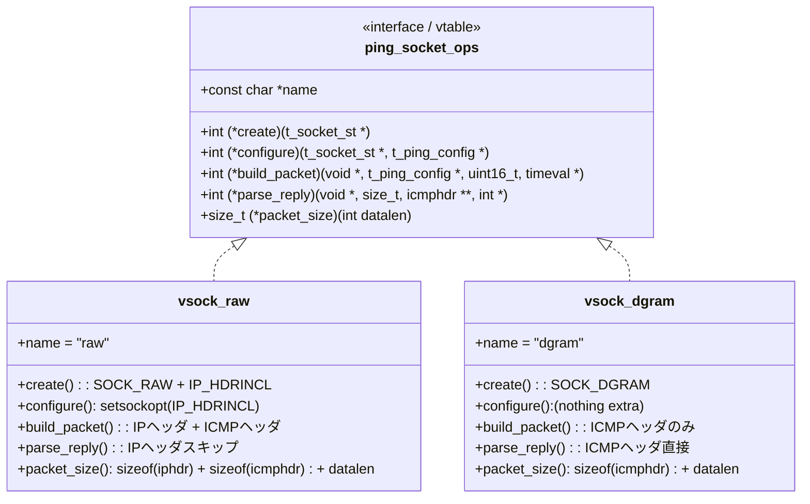
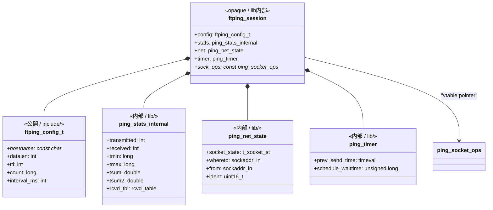
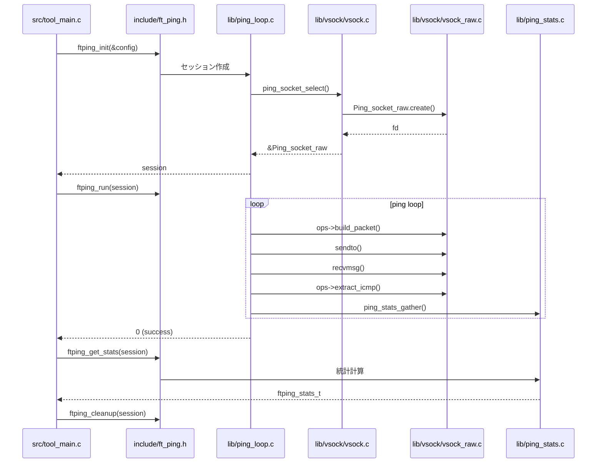
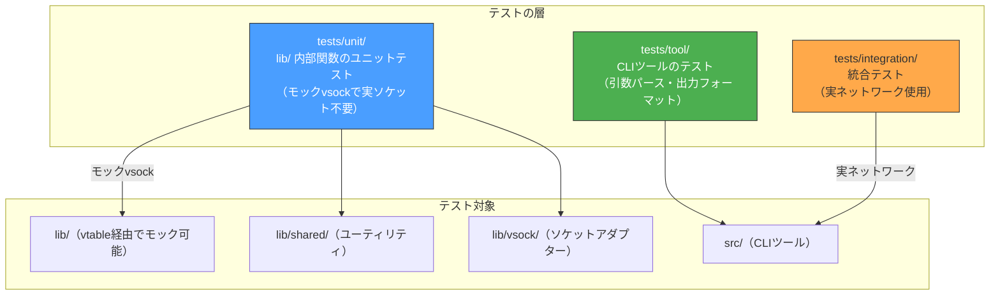
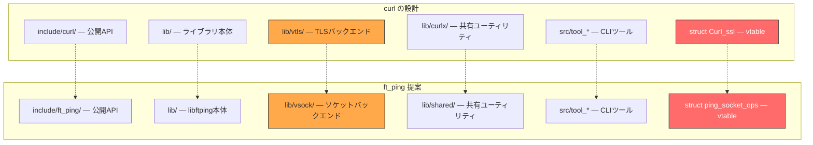

curlリポジトリの設計原則を参考に、ft_pingのディレクトリ構造と内部アーキテクチャを見直す。

---

## 1. curlから学ぶ設計原則

curlは約1200ファイル・17万行のCプロジェクトだが、その設計原則はft_ping（約1200行）にもスケールダウンして適用できる。

### curlの構造の要点



### curlから抽出した7つの設計原則

| # | 原則 | curlでの実装 | ft_pingへの適用 |
|---|------|-------------|----------------|
| 1 | **ライブラリとCLIの完全分離** | `src/` → `include/` → `lib/` の一方向依存 | `lib/` と `src/` を分離 |
| 2 | **vtable方式でポリモーフィズム** | `struct Curl_ssl`（18個の関数ポインタ） | ソケット種別の分岐を抽象化 |
| 3 | **`v`プレフィックスで差し替え可能性を明示** | `vtls/`, `vquic/`, `vssh/` | `vsock/`（RAW/DGRAM切り替え） |
| 4 | **共有ユーティリティの独立切り出し** | `lib/curlx/`（lib/とsrc/で共有） | `lib/shared/` |
| 5 | **ファイル名プレフィックスで役割を示す** | `tool_*`, `curl_*`, `cf-*`, `asyn-*` | `ping_*`, `tool_*` |
| 6 | **公開/内部ヘッダーの明確な境界** | `include/curl/` vs `lib/*.h` | `include/` vs `lib/*.h` |
| 7 | **#ifdefによる機能除去** | `CURL_DISABLE_FTP`等 | `PING_DISABLE_RAW`等（将来） |

---

## 2. 現状のft_ping構造と課題

### 現状のディレクトリ構成

```
ft_ping/
├── cmd/ft_ping/
│   ├── ft_ping.c      # main + main_loop + pinger（169行）
│   ├── ft_ping.h      # 全宣言の巨大ヘッダー（176行）
│   ├── usecases.c     # 設定+引数+シグナル+初期化+統計+受信+解析（566行）
│   ├── infra.c        # ソケット+DNS+送信+タイムアウト（111行）
│   ├── icmp.c/h       # ICMPパケット構築（77行）
│   ├── dto.h          # 受信DTO（21行）
│   └── utils.c        # error+parse_long（54行）
└── tests/
```

### 構造上の課題



#### `usecases.c` の責任混載の詳細



---

## 3. 提案するディレクトリ構成

curlの `lib/` + `src/` 分離と `v`プレフィックスディレクトリを参考にした構成：

```
ft_ping/
├── include/ft_ping/           # 公開API（ライブラリとして使う場合のインターフェース）
│   └── ft_ping.h              #   公開型定義 + API宣言
│
├── lib/                       # libftping 本体（CLIを知らない）
│   ├── ping_config.c/h        #   設定初期化・デフォルト値
│   ├── ping_stats.c/h         #   統計蓄積・重複検出・最終統計計算
│   ├── ping_icmp.c/h          #   ICMPパケット構築・応答解析
│   ├── ping_loop.c/h          #   メインpingループ・送信タイミング制御
│   ├── ping_schedule.c/h      #   終了スケジューリング
│   ├── vsock/                  #   ソケット種別抽象化（curlの vtls/ に相当）
│   │   ├── vsock.h             #     struct ping_socket_ops（vtable定義）
│   │   ├── vsock.c             #     バックエンド選択ロジック
│   │   ├── vsock_raw.c         #     SOCK_RAW アダプター
│   │   └── vsock_dgram.c       #     SOCK_DGRAM アダプター
│   ├── shared/                  #   共有ユーティリティ（curlの curlx/ に相当）
│   │   ├── shared_error.c/h     #     error()関数
│   │   ├── shared_parse.c/h     #     parse_long()
│   │   └── shared_net.c/h       #     DNS解決・送信元アドレス取得
│   └── ping_internal.h        #   lib内部ヘッダー（src/からは参照しない）
│
├── src/                       # CLIツール（lib/の公開APIのみ使用）
│   ├── tool_main.c            #   main() + エントリーポイント
│   ├── tool_getparam.c/h      #   引数パース（-c, -s, -t等）
│   ├── tool_signal.c/h        #   シグナルハンドラ設定
│   ├── tool_output.c/h        #   表示フォーマット（将来JSON出力等に拡張可能）
│   └── tool_cleanup.c/h       #   リソース解放・on_exit
│
├── tests/                     # テストスイート
│   ├── unit/                  #   ユニットテスト（lib/の内部関数）
│   └── tool/                  #   CLIツールのテスト
│
└── docs/                      # ドキュメント
```

### curlとの構造対応表



---

## 4. 依存関係の方向

curlと同じ**一方向依存**を徹底する：



**ルール：**
- `lib/` は `src/` を一切 `#include` しない
- `src/` は `lib/` の公開API（`include/ft_ping/ft_ping.h`）経由でのみアクセス
- `lib/shared/` は `src/` と `lib/` の両方から使用可能（curlxパターン）

---

## 5. vtable方式によるソケット種別抽象化

### 現状の問題

`if (socktype == SOCK_RAW)` の分岐が以下の**4箇所**に散在：

1. `ft_ping.c:51` — パケットサイズ計算
2. `usecases.c:224` — IP_HDRINCL設定
3. `usecases.c:294` — send_ping_usecaseでIPヘッダ構築判定
4. `usecases.c:434` — parse_replyでIPヘッダスキップ判定

### curlの vtls/ に倣った解決策



#### vtableの定義

```c
/* lib/vsock/vsock.h */
struct ping_socket_ops {
    const char *name;

    /* ソケット作成。成功時: fd, 失敗時: -1 */
    int  (*create)(t_socket_st *st);

    /* ソケットオプション設定（IP_HDRINCL等） */
    int  (*configure)(t_socket_st *st, int ttl, int tos);

    /* 送信パケット構築（IPヘッダの有無を吸収） */
    int  (*build_packet)(void *buf, size_t buflen,
                         struct in_addr src, struct in_addr dst,
                         uint16_t seq, int datalen,
                         struct timeval *timestamp);

    /* 受信パケットからICMPヘッダを抽出（IPヘッダスキップを吸収） */
    int  (*extract_icmp)(void *packet, size_t len,
                         struct icmphdr **out_icmp, int *out_icmp_len);

    /* パケット全体サイズを計算 */
    size_t (*packet_size)(int datalen);
};
```

#### const構造体による実装（curlの `Curl_ssl_openssl` パターン）

```c
/* lib/vsock/vsock_raw.c */
const struct ping_socket_ops Ping_socket_raw = {
    .name         = "raw",
    .create       = raw_create,
    .configure    = raw_configure,     /* IP_HDRINCL設定 */
    .build_packet = raw_build_packet,  /* IPヘッダ + ICMPヘッダ */
    .extract_icmp = raw_extract_icmp,  /* ip->ihl*4 バイトスキップ */
    .packet_size  = raw_packet_size,   /* sizeof(iphdr) + sizeof(icmphdr) + datalen */
};

/* lib/vsock/vsock_dgram.c */
const struct ping_socket_ops Ping_socket_dgram = {
    .name         = "dgram",
    .create       = dgram_create,
    .configure    = dgram_configure,     /* 追加設定なし */
    .build_packet = dgram_build_packet,  /* ICMPヘッダのみ */
    .extract_icmp = dgram_extract_icmp,  /* 先頭がICMP */
    .packet_size  = dgram_packet_size,   /* sizeof(icmphdr) + datalen */
};
```

#### バックエンド選択（curlの `vtls.c` パターン）

```c
/* lib/vsock/vsock.c */
const struct ping_socket_ops *ping_socket_select(void) {
    t_socket_st st;
    /* まずRAWを試す */
    if (Ping_socket_raw.create(&st) >= 0) {
        close(st.fd);
        return &Ping_socket_raw;
    }
    /* 権限不足ならDGRAMにフォールバック */
    if (errno == EPERM || errno == EACCES) {
        if (Ping_socket_dgram.create(&st) >= 0) {
            close(st.fd);
            return &Ping_socket_dgram;
        }
    }
    return NULL; /* 両方失敗 */
}
```

### 適用後の効果

**Before:**
```c
/* 4箇所に散在する分岐 */
if (master->socket_state.socktype == SOCK_RAW) {
    packet_size += sizeof(struct iphdr);
}
// ...
if (sock_state->socktype == SOCK_RAW) {
    set_ip_header(packet, ...);
}
// ...
if (master->socket_state.socktype == SOCK_RAW) {
    ip = (struct iphdr *)packet;
    icmp = (struct icmphdr *)((char *)packet + (ip->ihl * 4));
}
```

**After:**
```c
/* vtable経由で呼ぶだけ。分岐はアダプター内部に閉じる */
size_t pktlen = ops->packet_size(config->datalen);
ops->build_packet(buf, pktlen, src, dst, seq, datalen, &ts);
ops->extract_icmp(recv_buf, recv_len, &icmp, &icmp_len);
```

---

## 6. 公開API設計

curlの `include/curl/curl.h` に倣い、ライブラリとしての公開APIを定義する：

```c
/* include/ft_ping/ft_ping.h */
#ifndef FTPING_H
#define FTPING_H

#include <netinet/in.h>
#include <stdint.h>

/* ── 公開型定義 ── */

typedef struct ftping_config {
    const char *hostname;
    int   datalen;
    int   ttl;
    int   tos;
    long  count;        /* 0 = 無限 */
    int   interval_ms;
    int   deadline_sec;
    int   verbose;
    int   adaptive;
} ftping_config_t;

typedef struct ftping_stats {
    int    transmitted;
    int    received;
    long   repeats;
    double rtt_min_ms;
    double rtt_avg_ms;
    double rtt_max_ms;
    double rtt_mdev_ms;
} ftping_stats_t;

typedef struct ftping_session ftping_session_t;  /* opaque */

/* ── 公開API ── */

ftping_session_t *ftping_init(const ftping_config_t *config);
int               ftping_run(ftping_session_t *session);
ftping_stats_t    ftping_get_stats(const ftping_session_t *session);
void              ftping_stop(ftping_session_t *session);
void              ftping_cleanup(ftping_session_t *session);
const char       *ftping_strerror(int errcode);

#endif /* FTPING_H */
```

**CLIツール（`src/`）からの使用例：**

```c
/* src/tool_main.c */
#include <ft_ping/ft_ping.h>

int main(int argc, char **argv) {
    ftping_config_t config = parse_args(argc, argv);
    ftping_session_t *session = ftping_init(&config);
    ftping_run(session);
    ftping_stats_t stats = ftping_get_stats(session);
    print_statistics(&stats);
    ftping_cleanup(session);
}
```

---

## 7. ファイル名プレフィックス規則

curlの命名規則を参考にした一貫したプレフィックス：

| プレフィックス | 場所 | 役割 | 例 |
|------------|------|------|-----|
| `ping_*` | `lib/` | ライブラリ内部コード | `ping_config.c`, `ping_stats.c`, `ping_loop.c` |
| `vsock_*` | `lib/vsock/` | ソケット種別アダプター | `vsock_raw.c`, `vsock_dgram.c` |
| `shared_*` | `lib/shared/` | 共有ユーティリティ | `shared_error.c`, `shared_parse.c`, `shared_net.c` |
| `tool_*` | `src/` | CLIツール固有コード | `tool_main.c`, `tool_getparam.c`, `tool_output.c` |

---

## 8. ヘッダーのインクルードガード規則

curlに倣い、公開/内部で異なるプレフィックスを使用：

```c
/* 公開ヘッダー: include/ft_ping/ */
#ifndef FTPING_H        /* FTPING_ プレフィックス */

/* 内部ヘッダー: lib/ */
#ifndef HEADER_PING_STATS_H  /* HEADER_PING_ プレフィックス */

/* vsockヘッダー: lib/vsock/ */
#ifndef HEADER_VSOCK_H       /* HEADER_VSOCK_ プレフィックス */
```

---

## 9. 構造体の再設計

curlの `struct Curl_easy`（セッション状態）に倣い、`t_ping_master` を分解：



---

## 10. データフロー（提案後）



---

## 11. 既存コードからの移行マッピング

| 現在のファイル | 移行先 | 備考 |
|-------------|--------|------|
| `cmd/ft_ping/ft_ping.c` (main) | `src/tool_main.c` | CLIエントリーポイント |
| `cmd/ft_ping/ft_ping.c` (main_loop) | `lib/ping_loop.c` | ライブラリ側に移動 |
| `cmd/ft_ping/ft_ping.c` (pinger) | `lib/ping_loop.c` | static変数を構造体メンバに |
| `cmd/ft_ping/usecases.c` (configure_state) | `lib/ping_config.c` | |
| `cmd/ft_ping/usecases.c` (parse_arg) | `src/tool_getparam.c` | CLI側の責任 |
| `cmd/ft_ping/usecases.c` (signal_handler) | `src/tool_signal.c` | CLI側の責任 |
| `cmd/ft_ping/usecases.c` (initialize) | `lib/ping_loop.c` | ソケット初期化 |
| `cmd/ft_ping/usecases.c` (gather_statistics) | `lib/ping_stats.c` | |
| `cmd/ft_ping/usecases.c` (finish_statistics) | `lib/ping_stats.c` | |
| `cmd/ft_ping/usecases.c` (receive_replies) | `lib/ping_loop.c` | |
| `cmd/ft_ping/usecases.c` (parse_reply) | `lib/ping_icmp.c` | |
| `cmd/ft_ping/usecases.c` (schedule_exit) | `lib/ping_schedule.c` | |
| `cmd/ft_ping/usecases.c` (show_usage) | `src/tool_getparam.c` | |
| `cmd/ft_ping/usecases.c` (cleanup) | `src/tool_cleanup.c` | |
| `cmd/ft_ping/infra.c` (create_socket) | `lib/vsock/vsock_raw.c` + `vsock_dgram.c` | vtable化 |
| `cmd/ft_ping/infra.c` (dns_lookup) | `lib/shared/shared_net.c` | |
| `cmd/ft_ping/infra.c` (send_packet) | `lib/shared/shared_net.c` | |
| `cmd/ft_ping/infra.c` (get_source_address) | `lib/shared/shared_net.c` | |
| `cmd/ft_ping/infra.c` (configure_socket_timeouts) | `lib/shared/shared_net.c` | |
| `cmd/ft_ping/infra.c` (is_ipv6_address) | `lib/shared/shared_net.c` | |
| `cmd/ft_ping/icmp.c/h` | `lib/ping_icmp.c/h` | チェックサム計算等 |
| `cmd/ft_ping/utils.c` (error) | `lib/shared/shared_error.c` | |
| `cmd/ft_ping/utils.c` (parse_long) | `lib/shared/shared_parse.c` | |
| `cmd/ft_ping/dto.h` | 削除 | vtable + 構造体分解で不要に |
| `cmd/ft_ping/ft_ping.h` | `include/ft_ping/ft_ping.h` + `lib/ping_internal.h` | 公開/内部に分離 |

---

## 12. テスト戦略

### 現状のテスト構成

現在のft_pingは以下の構成でテストを行っている：

- **テストフレームワーク**: Google Test（C++）
- **ビルドシステム**: CMake（FetchContentでgtestを自動取得）
- **テストバイナリ**: `InternalTests`（全テストを単一バイナリに統合）
- **テスト用ビルド**: `testftping`ライブラリ（`TESTING=1`マクロでerror()をlongjmp版に切り替え）

```
tests/                          # 現状：フラットな構成
├── CMakeLists.txt              #   gtest設定・テストバイナリ定義
├── test_main.cpp               #   テストエントリーポイント
├── test_parse_long.cpp         #   parse_long()のテスト
├── test_parse_arg_usecase.cpp  #   引数パースのテスト
├── test_is_ipv6_address.cpp    #   IPv6アドレス判定のテスト
├── test_dns_lookup.cpp         #   DNS解決のテスト
├── test_get_source_address.cpp #   送信元アドレス取得のテスト
└── test_create_socket_with_fallback.cpp  # ソケット作成のテスト
```

**現状のテスト手法の特徴：**
- `extern "C" { #include "ft_ping.h" }` でCの関数をC++テストから呼び出し
- `TESTING`マクロで`error()`をlongjmp版に差し替え、`setjmp`/`longjmp`でexit()をキャッチ
- テスト用のerrorWrapper関数（C++例外に変換）でテスタビリティを確保
- `::testing::Test`のSetUp/TearDownで`test_err_jmp_buf_set`フラグを管理

### 提案するテストディレクトリ構成

リファクタ後の `lib/` + `src/` 分離に対応し、テストも責任ごとに分離する：

```
tests/
├── CMakeLists.txt              # テスト全体のビルド設定
│
├── unit/                       # lib/ 内部関数のユニットテスト
│   ├── CMakeLists.txt          #   UnitTestsバイナリ定義
│   ├── test_main.cpp           #   テストエントリーポイント
│   ├── test_ping_config.cpp    #   ping_config.c のテスト（デフォルト値、構造体初期化）
│   ├── test_ping_stats.cpp     #   ping_stats.c のテスト（統計計算、重複検出）
│   ├── test_ping_icmp.cpp      #   ping_icmp.c のテスト（チェックサム、パケット構築・解析）
│   ├── test_ping_schedule.cpp  #   ping_schedule.c のテスト（終了スケジューリング）
│   ├── test_shared_parse.cpp   #   shared_parse.c のテスト（parse_long — 現test_parse_long.cpp）
│   ├── test_shared_net.cpp     #   shared_net.c のテスト（DNS解決、送信元アドレス — 現test_dns_lookup.cpp等を統合）
│   ├── test_shared_error.cpp   #   shared_error.c のテスト（error()のlongjmpテスト）
│   ├── test_vsock_raw.cpp      #   vsock_raw.c のテスト（RAWソケット固有の処理）
│   ├── test_vsock_dgram.cpp    #   vsock_dgram.c のテスト（DGRAMソケット固有の処理）
│   ├── test_vsock_select.cpp   #   vsock.c のテスト（バックエンド選択ロジック）
│   └── mock/                   #   テスト用モック
│       ├── mock_vsock.cpp      #     ソケットvtableモック
│       └── mock_vsock.h        #     モックヘッダー
│
├── tool/                       # src/ CLIツールのテスト
│   ├── CMakeLists.txt          #   ToolTestsバイナリ定義
│   ├── test_main.cpp           #   テストエントリーポイント
│   ├── test_tool_getparam.cpp  #   引数パースのテスト（現test_parse_arg_usecase.cpp）
│   └── test_tool_output.cpp    #   出力フォーマットのテスト
│
└── integration/                # 統合テスト（実ネットワーク使用）
    ├── CMakeLists.txt          #   IntegrationTestsバイナリ定義
    ├── test_main.cpp           #   テストエントリーポイント
    ├── test_ping_localhost.cpp #   localhostへのpingテスト
    └── test_ping_options.cpp   #   各オプションの組み合わせテスト
```



### テストの層と目的

**① Unit Tests (`tests/unit/`) — ソケット不要・CI安全**

lib/の各モジュールを個別にテスト。vtableモックにより実ソケットやroot権限なしで実行可能。

テスト対象と方法：

- **`test_ping_config.cpp`** — `configure_state_usecase()`相当の初期化関数が正しいデフォルト値を設定するか
- **`test_ping_stats.cpp`** — `gather_statistics_usecase()`と`finish_statistics_usecase()`の統計計算。RTT統計（min/avg/max/mdev）の数値精度、重複検出（`rcvd_set`/`rcvd_test`）の正確性
- **`test_ping_icmp.cpp`** — `set_icmp_header_data()`のチェックサム計算、パケット構築の正確性。`parse_reply()`相当のICMPタイプ判別・シーケンス番号抽出
- **`test_vsock_raw.cpp`** / **`test_vsock_dgram.cpp`** — 各vtable実装の`build_packet()`と`extract_icmp()`が正しいオフセットでパケットを構築・解析するか
- **`test_shared_parse.cpp`** — 既存の`test_parse_long.cpp`を移行。境界値・不正入力・範囲外のテスト
- **`test_shared_net.cpp`** — 既存の`test_dns_lookup.cpp`+`test_is_ipv6_address.cpp`+`test_get_source_address.cpp`を統合

**② Tool Tests (`tests/tool/`) — CLIインターフェースのテスト**

src/の引数パースと出力フォーマットをテスト。

- **`test_tool_getparam.cpp`** — 既存の`test_parse_arg_usecase.cpp`を移行。各オプション（-v, -c, -s, -t, -A, -D, -e等）の個別テスト、不正なオプションのエラーハンドリング、複数オプション組み合わせ
- **`test_tool_output.cpp`** — 出力文字列のフォーマットテスト（将来JSON出力対応時に重要）

**③ Integration Tests (`tests/integration/`) — 実ネットワーク使用**

実際にICMPパケットを送受信するテスト。CI環境では特権（CAP_NET_RAW）が必要。

- **`test_ping_localhost.cpp`** — `127.0.0.1`へのping送受信。パケット数指定（-c）で正しく終了するか
- **`test_ping_options.cpp`** — 各オプション（-t, -s, -w等）が実際のping動作に反映されるか

### vtableによるテストモック

リファクタ後のvsock vtable構造を利用して、実ソケットを使わないモックを構築できる：

```c
/* tests/unit/mock/mock_vsock.cpp */

/* モック状態の管理 */
struct MockVsockState {
    int send_count;
    int recv_count;
    std::vector<std::vector<uint8_t>> sent_packets;  /* 送信されたパケットを記録 */
    std::vector<uint8_t> next_recv_packet;            /* 次のrecvで返すパケット */
    
    void reset() {
        send_count = 0;
        recv_count = 0;
        sent_packets.clear();
        next_recv_packet.clear();
    }
};

static MockVsockState mock_state;

static int mock_create(t_socket_st *st) {
    st->fd = 999;  /* ダミーfd */
    st->socktype = SOCK_DGRAM;
    return 999;
}

static int mock_configure(t_socket_st *st, int ttl, int tos) {
    (void)st; (void)ttl; (void)tos;
    return 0;
}

static int mock_build_packet(void *buf, size_t buflen,
                             struct in_addr src, struct in_addr dst,
                             uint16_t seq, int datalen,
                             struct timeval *timestamp) {
    (void)src; (void)dst; (void)seq; (void)datalen; (void)timestamp;
    mock_state.send_count++;
    memset(buf, 0, buflen);

    /* 送信パケットを記録 */
    std::vector<uint8_t> pkt((uint8_t*)buf, (uint8_t*)buf + buflen);
    mock_state.sent_packets.push_back(pkt);
    return 0;
}

static int mock_extract_icmp(void *packet, size_t len,
                             struct icmphdr **out_icmp, int *out_icmp_len) {
    mock_state.recv_count++;
    *out_icmp = (struct icmphdr *)packet;
    *out_icmp_len = (int)len;
    return 0;
}

static size_t mock_packet_size(int datalen) {
    return sizeof(struct icmphdr) + datalen;
}

/* モックvtableインスタンス */
const struct ping_socket_ops Mock_socket_ops = {
    .name          = "mock",
    .create        = mock_create,
    .configure     = mock_configure,
    .build_packet  = mock_build_packet,
    .extract_icmp  = mock_extract_icmp,
    .packet_size   = mock_packet_size,
};
```

### テストでのモック使用例

```cpp
/* tests/unit/test_ping_stats.cpp */
#include <gtest/gtest.h>

extern "C" {
#include "ping_stats.h"
}

class PingStatsTest : public ::testing::Test {
protected:
    t_ping_stats stats;
    
    void SetUp() override {
        memset(&stats, 0, sizeof(stats));
        stats.tmin = LONG_MAX;
        stats.timing = 1;
    }
};

TEST_F(PingStatsTest, GatherUpdatesMinRtt) {
    ping_stats_gather(&stats, 1, 50000, 0);  /* 50ms */
    EXPECT_EQ(stats.tmin, 50000);
    EXPECT_EQ(stats.tmax, 50000);
    EXPECT_EQ(stats.nreceived, 1);
}

TEST_F(PingStatsTest, GatherTracksDuplicates) {
    ping_stats_gather(&stats, 1, 50000, 0);
    ping_stats_gather(&stats, 1, 50000, 1);  /* duplicate */
    EXPECT_EQ(stats.nreceived, 1);  /* 重複はカウントしない */
    EXPECT_EQ(stats.nrepeats, 1);
}

TEST_F(PingStatsTest, RcvdTableDetectsDuplicates) {
    rcvd_set_internal(&stats, 42);
    EXPECT_NE(rcvd_test_internal(&stats, 42), 0);
    EXPECT_EQ(rcvd_test_internal(&stats, 43), 0);
}
```

```cpp
/* tests/unit/test_vsock_dgram.cpp — vtable実装のテスト */
#include <gtest/gtest.h>

extern "C" {
#include "vsock/vsock.h"
}

TEST(VsockDgramTest, PacketSizeExcludesIpHeader) {
    /* DGRAM はIPヘッダーを含まない */
    size_t size = Ping_socket_dgram.packet_size(56);
    EXPECT_EQ(size, sizeof(struct icmphdr) + 56);
}

TEST(VsockDgramTest, ExtractIcmpStartsAtOffset0) {
    /* DGRAM の受信パケットは先頭がICMP */
    uint8_t packet[128] = {};
    struct icmphdr *icmp = NULL;
    int icmp_len = 0;
    
    Ping_socket_dgram.extract_icmp(packet, 128, &icmp, &icmp_len);
    EXPECT_EQ((void*)icmp, (void*)packet);  /* オフセット0 */
    EXPECT_EQ(icmp_len, 128);
}
```

```cpp
/* tests/unit/test_vsock_raw.cpp — RAW実装との比較テスト */
#include <gtest/gtest.h>

extern "C" {
#include "vsock/vsock.h"
}

TEST(VsockRawTest, PacketSizeIncludesIpHeader) {
    /* RAW はIPヘッダーを含む */
    size_t size = Ping_socket_raw.packet_size(56);
    EXPECT_EQ(size, sizeof(struct iphdr) + sizeof(struct icmphdr) + 56);
}

TEST(VsockRawTest, ExtractIcmpSkipsIpHeader) {
    /* RAW の受信パケットはIPヘッダーの後にICMP */
    uint8_t packet[128] = {};
    struct iphdr *ip = (struct iphdr *)packet;
    ip->ihl = 5;  /* 20バイトのIPヘッダー */
    
    struct icmphdr *icmp = NULL;
    int icmp_len = 0;
    
    Ping_socket_raw.extract_icmp(packet, 128, &icmp, &icmp_len);
    EXPECT_EQ((void*)icmp, (void*)(packet + 20));  /* IPヘッダー分スキップ */
    EXPECT_EQ(icmp_len, 108);  /* 128 - 20 */
}
```

### 既存テストの移行マッピング

| 現在のファイル | 移行先 | 備考 |
|-------------|--------|------|
| `tests/test_main.cpp` | `tests/unit/test_main.cpp` + `tests/tool/test_main.cpp` | 各テスト層にエントリーポイントを用意 |
| `tests/test_parse_long.cpp` | `tests/unit/test_shared_parse.cpp` | shared_parse.c のテストとして移行 |
| `tests/test_dns_lookup.cpp` | `tests/unit/test_shared_net.cpp` | shared_net.c のテストに統合 |
| `tests/test_is_ipv6_address.cpp` | `tests/unit/test_shared_net.cpp` | 同上 |
| `tests/test_get_source_address.cpp` | `tests/unit/test_shared_net.cpp` | 同上 |
| `tests/test_create_socket_with_fallback.cpp` | `tests/unit/test_vsock_select.cpp` | vsock バックエンド選択のテストとして移行 |
| `tests/test_parse_arg_usecase.cpp` | `tests/tool/test_tool_getparam.cpp` | CLIツール側のテストとして移行 |

### CMake構成の提案

```cmake
# tests/CMakeLists.txt（トップレベル）
enable_testing()
add_subdirectory(unit)
add_subdirectory(tool)

# 統合テストはオプション（CI環境でCAP_NET_RAWが必要）
option(ENABLE_INTEGRATION_TESTS "Enable integration tests (requires network)" OFF)
if(ENABLE_INTEGRATION_TESTS)
    add_subdirectory(integration)
endif()
```

```cmake
# tests/unit/CMakeLists.txt
include(GoogleTest)

file(GLOB_RECURSE UNIT_TEST_SOURCES "${CMAKE_CURRENT_SOURCE_DIR}/*.cpp")

add_executable(UnitTests ${UNIT_TEST_SOURCES})

target_link_libraries(UnitTests 
    testftping          # TESTING=1でビルドされたlib
    GTest::GTest 
    GTest::Main
)

target_include_directories(UnitTests PRIVATE
    ${CMAKE_SOURCE_DIR}/lib
    ${CMAKE_SOURCE_DIR}/lib/vsock
    ${CMAKE_SOURCE_DIR}/lib/shared
    ${CMAKE_SOURCE_DIR}/include/ft_ping
)

target_compile_definitions(UnitTests PRIVATE TESTING=1)

gtest_discover_tests(UnitTests)
```

```cmake
# tests/tool/CMakeLists.txt
include(GoogleTest)

file(GLOB_RECURSE TOOL_TEST_SOURCES "${CMAKE_CURRENT_SOURCE_DIR}/*.cpp")

add_executable(ToolTests ${TOOL_TEST_SOURCES})

target_link_libraries(ToolTests
    testftping
    GTest::GTest
    GTest::Main
)

target_include_directories(ToolTests PRIVATE
    ${CMAKE_SOURCE_DIR}/src
    ${CMAKE_SOURCE_DIR}/include/ft_ping
    ${CMAKE_SOURCE_DIR}/lib/shared    # shared_parse等を使う場合
)

target_compile_definitions(ToolTests PRIVATE TESTING=1)

gtest_discover_tests(ToolTests)
```

```cmake
# tests/integration/CMakeLists.txt
include(GoogleTest)

file(GLOB_RECURSE INTEGRATION_TEST_SOURCES "${CMAKE_CURRENT_SOURCE_DIR}/*.cpp")

add_executable(IntegrationTests ${INTEGRATION_TEST_SOURCES})

target_link_libraries(IntegrationTests
    testftping
    GTest::GTest
    GTest::Main
)

target_include_directories(IntegrationTests PRIVATE
    ${CMAKE_SOURCE_DIR}/include/ft_ping
)

target_compile_definitions(IntegrationTests PRIVATE TESTING=1)

# 統合テストは特権が必要なためCTestのラベルで分離
gtest_discover_tests(IntegrationTests PROPERTIES LABELS "integration")
```

### error()のテスト戦略（TESTING マクロパターンの継続）

現在の `TESTING` マクロによる `error()` 差し替えは良いパターンなので継続する。
リファクタ後は `lib/shared/shared_error.c` 内で条件コンパイルする：

```c
/* lib/shared/shared_error.c */
#ifdef TESTING
int last_error_status = 0;
int test_err_jmp_buf_set = 0;
char last_error_message[256];
jmp_buf test_err_jmp_buf;

void error(int status, const char *format, ...) {
    va_list ap;
    memset(last_error_message, 0, sizeof(last_error_message));
    last_error_status = status;
    va_start(ap, format);
    vsnprintf(last_error_message, sizeof(last_error_message), format, ap);
    va_end(ap);
    if (status && test_err_jmp_buf_set) {
        longjmp(test_err_jmp_buf, status);
    }
}
#else
void error(int status, const char *format, ...) {
    va_list ap;
    fprintf(stderr, "%s: ", program_invocation_short_name);
    va_start(ap, format);
    vfprintf(stderr, format, ap);
    va_end(ap);
    if (status)
        exit(status);
}
#endif
```

テスト側では引き続き `setjmp`/`longjmp` またはC++例外ラッパーでキャッチ：

```cpp
/* tests/unit/test_shared_error.cpp */
#include <gtest/gtest.h>

extern "C" {
#include "shared/shared_error.h"
}

class SharedErrorTest : public ::testing::Test {
protected:
    void SetUp() override {
        test_err_jmp_buf_set = 1;
        memset(last_error_message, 0, sizeof(last_error_message));
        last_error_status = 0;
    }
    void TearDown() override {
        test_err_jmp_buf_set = 0;
    }
};

TEST_F(SharedErrorTest, NonFatalErrorDoesNotJump) {
    error(0, "warning: %s", "test");
    EXPECT_EQ(last_error_status, 0);
    EXPECT_TRUE(strstr(last_error_message, "warning: test") != nullptr);
}

TEST_F(SharedErrorTest, FatalErrorJumps) {
    if (setjmp(test_err_jmp_buf) == 0) {
        error(1, "fatal: %s", "test");
        FAIL() << "Expected longjmp";
    } else {
        EXPECT_EQ(last_error_status, 1);
        EXPECT_TRUE(strstr(last_error_message, "fatal: test") != nullptr);
    }
}
```

### テスト実行コマンド

```bash
# ユニットテストのみ（ソケット不要、CI安全）
cd build && cmake .. && make UnitTests && ctest -L unit

# CLIツールテスト
cd build && cmake .. && make ToolTests && ctest -L tool

# 統合テスト（CAP_NET_RAW必要）
cd build && cmake -DENABLE_INTEGRATION_TESTS=ON .. && make IntegrationTests
sudo ctest -L integration

# 全テスト実行
cd build && cmake -DENABLE_INTEGRATION_TESTS=ON .. && make && ctest

# カバレッジ（既存のMakefileターゲットを継続）
make cov
```

---

## 13. 将来の拡張ポイント

この構造が整えば、以下の拡張がアダプター追加だけで実現できる：

| 拡張 | 変更箇所 | 既存コードへの影響 |
|------|---------|----------------|
| **IPv6対応** | `lib/vsock/vsock_raw6.c` 追加 | なし（新アダプター） |
| **JSON出力** | `src/tool_output.c` 修正 | lib/ に影響なし |
| **ライブラリとして組み込み** | `include/ft_ping/ft_ping.h` 経由 | src/ なしでビルド可能 |
| **テスト強化** | `tests/unit/` にモックvsock追加 | 実ソケット不要 |
| **ICMPv6** | `lib/ping_icmp6.c` + `vsock_raw6.c` | 既存ICMPv4に影響なし |
| **機能除去（組み込み向け）** | `#ifndef PING_DISABLE_RAW` | コンパイル時除去 |

---

## 14. まとめ：curlとft_pingの設計対応



curlの設計は「1200行のプロジェクトにはオーバーキル」に見えるかもしれないが、**ディレクトリ構造と命名規則のコストはほぼゼロ**で、将来の拡張性とテスタビリティに大きく効く。特に `vsock/` によるソケット種別抽象化は、現在のコードに散在する `if (socktype == SOCK_RAW)` を完全に解消できる最も効果的なリファクタリングポイント。
