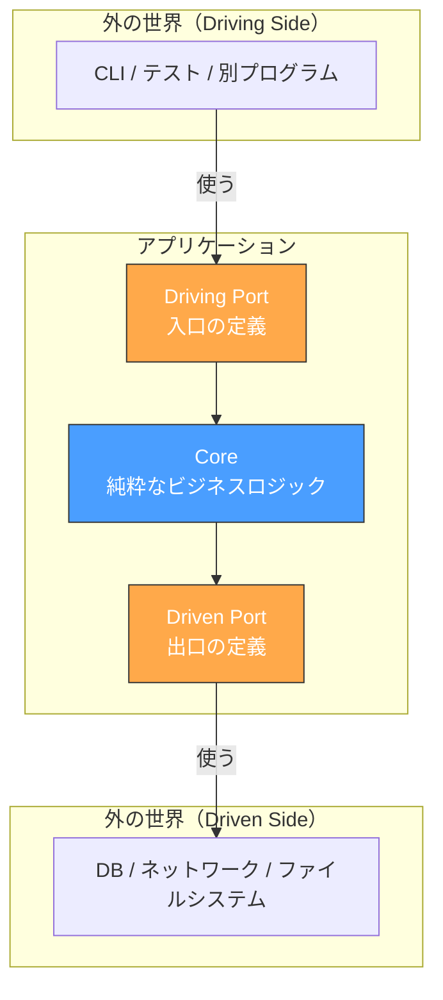
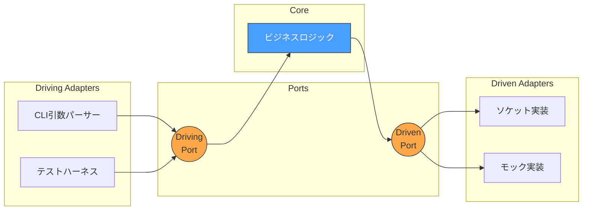
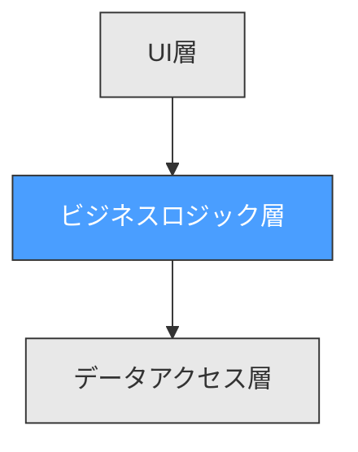
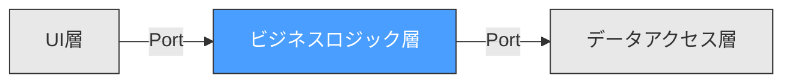

# Hexagonal Architecture（ヘキサゴナルアーキテクチャ）

## 概要

Hexagonal Architecture（別名: Ports and Adapters）は、2005年にAlistair Cockburnが提唱したソフトウェア設計パターンです。

**核心のアイデア：アプリケーションのコアロジックは、外部の技術的詳細を一切知らない。**



## 3つの構成要素

### 1. Core（コア / ドメイン）

アプリケーションの**本質的なロジック**を持つ層。外部への依存がゼロ。

- OSもDBもネットワークも知らない
- 純粋な関数・データ構造だけで構成
- **テストが最も容易**

### 2. Port（ポート）

コアと外部の**接続口の定義**。インターフェースに相当する。

| 種類 | 方向 | 役割 | 例 |
|------|------|------|-----|
| Driving Port | 外 → コア | コアに何をさせるか | `config_parse_args()` |
| Driven Port | コア → 外 | コアが外部に何を頼むか | `t_ping_io.send_packet()` |

### 3. Adapter（アダプター）

ポートの**具体的な実装**。実際の外部リソースとやり取りする。

- 本番用アダプター：実際のソケット操作、DNS解決
- テスト用アダプター：モック実装



## 従来のアーキテクチャとの比較

### レイヤードアーキテクチャ（3層）



**問題点：** ビジネスロジックがデータアクセス層に**依存**する。テスト時にDBやソケットが必要。

### Hexagonal Architecture



**利点：** ビジネスロジックは**何にも依存しない**。依存の矢印が逆転する（**依存性逆転の原則**）。

## Cでの実現方法

Cにはインターフェース（Javaの`interface`やGoの`interface`）がないが、**関数ポインタ**で同等の機能を実現できる。

```c
// ─── Port定義（インターフェース） ───
typedef struct ping_io {
    int (*send_packet)(void *packet, size_t len, int sockfd, struct sockaddr_in *dest);
    ssize_t (*recv_packet)(int sockfd, struct msghdr *msg, int flags);
    void (*dns_lookup)(const char *hostname, struct sockaddr_in *addr);
} t_ping_io;

// ─── Core（ポートだけに依存） ───
void ping_loop(t_ping_master *master, t_ping_io *io) {
    // io->send_packet() で送る。実体がソケットかモックか知らない
    // io->recv_packet() で受ける
}

// ─── 本番アダプター ───
t_ping_io real_io = {
    .send_packet = net_send_packet,    // 実際のsendto()
    .recv_packet = net_recv_packet,    // 実際のrecvmsg()
    .dns_lookup  = net_dns_lookup,     // 実際のgetaddrinfo()
};

// ─── テストアダプター ───
t_ping_io mock_io = {
    .send_packet = mock_send_always_ok,
    .recv_packet = mock_recv_echo_reply,
    .dns_lookup  = mock_resolve_localhost,
};
```

## CLIツールとの相性

CLIツールは以下の特徴を持つため、Hexagonalとの相性が良い：

| CLIの特徴 | Hexagonalの恩恵 |
|-----------|----------------|
| 入力元が多様（引数, stdin, 環境変数） | Driving Adapterで吸収 |
| 出力先が多様（stdout, ファイル, ネットワーク） | Driven Adapterで吸収 |
| テスト困難（root権限、ネットワーク必要） | モックアダプターで解決 |
| ライブラリとしても使いたい | Coreを切り出せば再利用可能 |

## 参考文献

- Alistair Cockburn, "Hexagonal Architecture" (2005)
  - https://alistair.cockburn.us/hexagonal-architecture/
- Robert C. Martin, "Clean Architecture" (2017)
- Netflix Tech Blog, "Ready for changes with Hexagonal Architecture"
  - https://netflixtechblog.com/ready-for-changes-with-hexagonal-architecture-b315ec967749
