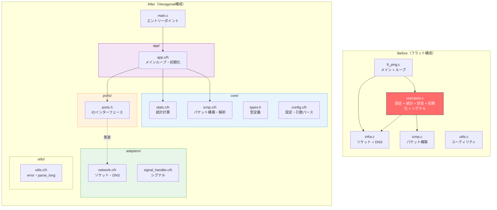
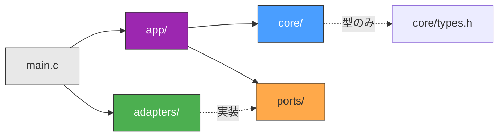
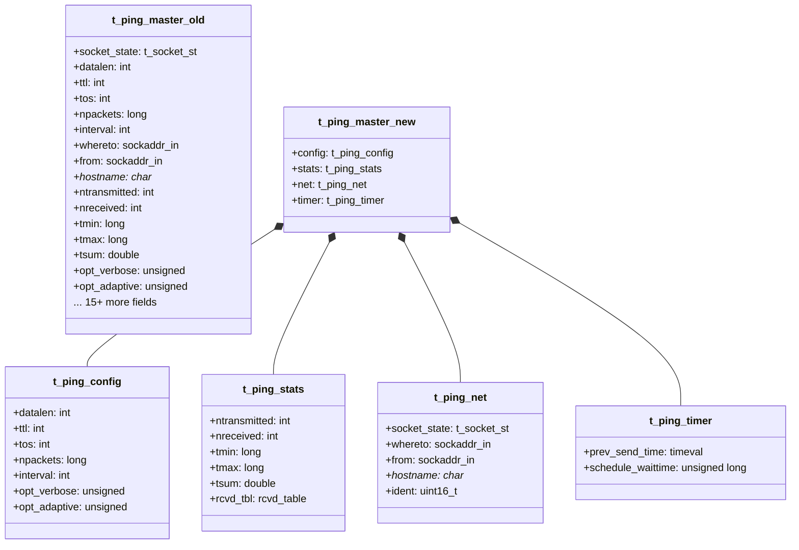
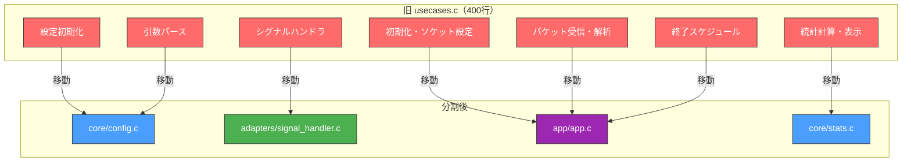
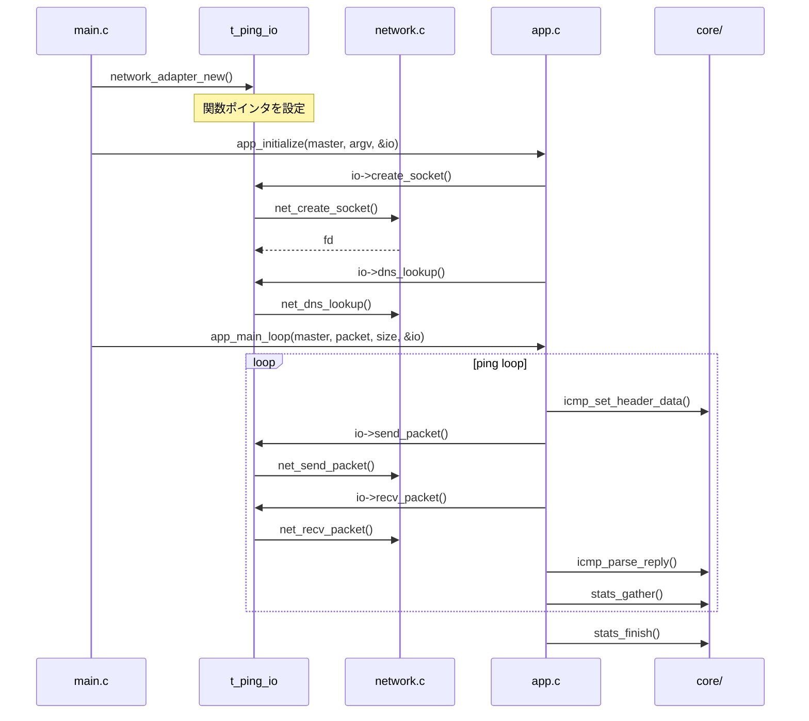
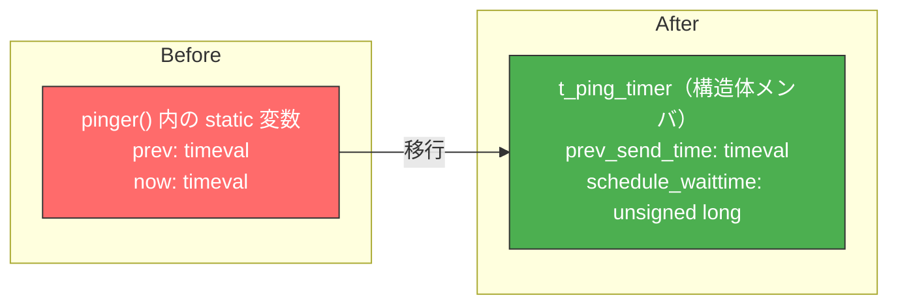
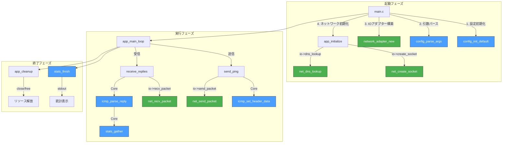

# ft_ping リファクタリングガイド

## Before → After: 全体像



## 依存関係の方向

リファクタ後の依存関係は**一方向**で、コアは外部を知らない：



**ポイント：**
- `core/` は `adapters/` を知らない
- `adapters/` は `ports/` のインターフェースを実装する
- `app/` がポートを通じてアダプターを呼び出す
- `main.c` がすべてを組み立てる（Composition Root）

## 変更点の詳細

### 1. 構造体の分解

旧 `t_ping_master` は30フィールド超の巨大構造体でした。これを関心領域ごとに分解：



**効果：**
- 各関数が**どの関心領域に触っているか**一目瞭然
- `stats_gather()` は `t_ping_stats` しか更新しない → 副作用の範囲が明確
- 構造体を引数に渡す粒度を細かくできる → テスタビリティ向上

### 2. ファイル分割（usecases.c の解体）

旧 `usecases.c`（約400行）は以下の**5つの責任**を混載していた：



### 3. IOポートの導入

テスト時にソケットやネットワークが不要になる仕組み：



**テスト時の差し替え例：**

```c
// テスト用のモックアダプター
static int mock_send(void *pkt, size_t len, int fd, struct sockaddr_in *to) {
    (void)pkt; (void)len; (void)fd; (void)to;
    return len;  // 常に成功
}

static ssize_t mock_recv(int fd, struct msghdr *msg, int flags) {
    (void)fd; (void)flags;
    // 事前に用意したエコー応答パケットをmsgに詰める
    memcpy(msg->msg_iov[0].iov_base, &mock_reply_packet, sizeof(mock_reply_packet));
    return sizeof(mock_reply_packet);
}

t_ping_io mock_io = {
    .create_socket = mock_create_socket,
    .dns_lookup = mock_dns_lookup,
    .get_source_address = mock_get_source,
    .configure_socket_timeouts = mock_configure_timeouts,
    .send_packet = mock_send,
    .recv_packet = mock_recv,
};

// これでroot権限もネットワークも不要でテスト可能！
app_main_loop(&master, packet, size, &mock_io);
```

### 4. 命名の改善

| Before | After | 理由 |
|--------|-------|------|
| `A(tbl, bit)` | `BITMAP_WORD(tbl, bit)` | 意図が明確 |
| `B(bit)` | `BITMAP_MASK(bit)` | 意図が明確 |
| `SCHINT(a)` | `CLAMP_INTERVAL(a)` | 「最小値でクランプ」の意 |
| `__schedule_exit` | `schedule_exit_internal` | ダブルアンダースコアは予約済み識別子 |
| `*_usecase()` | ファイル名で表現 | `core/stats.c` の `stats_gather()` |
| `configure_state_usecase()` | `config_init_default()` | 動詞+目的語で明確 |

### 5. static変数の排除

旧 `pinger()` 関数のstatic変数をタイマー構造体に移行：



**効果：**
- テスト間でstatic変数がリセットされない問題を解消
- 状態の寿命が明確（`t_ping_master` のライフタイムに一致）

## ファイル一覧と責任

```
cmd/ft_ping/
├── main.c                      # Composition Root（組み立て + エントリーポイント）
├── ft_ping.h                   # アンブレラヘッダー + 互換マクロ
├── core/                       # 🔵 外部依存なしの純粋ロジック
│   ├── types.h                 #    全構造体の型定義
│   ├── config.c/h              #    デフォルト設定、引数パース、usage表示
│   ├── stats.c/h               #    統計蓄積、重複検出、最終統計表示
│   └── icmp.c/h                #    ICMPパケット構築、応答パース
├── ports/                      # 🟠 インターフェース定義
│   └── ports.h                 #    t_ping_io（関数ポインタテーブル）
├── adapters/                   # 🟢 外部世界との接続実装
│   ├── network.c/h             #    ソケット、DNS、パケット送受信
│   └── signal_handler.c/h      #    SIGINT/SIGALRM ハンドラ
├── app/                        # 🟣 オーケストレーション
│   └── app.c/h                 #    初期化、メインループ、終了処理
└── utils/                      # ⚪ 汎用ユーティリティ
    └── utils.c/h               #    error()、parse_long()
```

## データフロー



🔵 = Core（外部依存なし）　🟢 = Adapter（外部接続）

## 今後の拡張ポイント

1. **テスト強化**: `t_ping_io` にモックを差し込んで、メインループの統合テストを追加
2. **出力のPort化**: `printf` をPort経由にすれば、出力フォーマットの切り替え（JSON出力等）が容易に
3. **IPv6対応**: `t_ping_net` にアドレスファミリを追加し、IPv6用アダプターを実装
4. **設定ファイル対応**: 新しいDriving Adapterとして設定ファイルリーダーを追加
